# KYLakesProject
A repo to explore arcGIS Pro capabilities, create a variety of visuals from remote data, and continue playing in the Python (numpy, pandas, scikit-learn), D3, and R sandbox.

<!-- TOC -->
## Table of Contents
- [Part I Project Summary Proposal](#part-i-project-summary-proposal)  
- [Part II Data Sources And Prep](#part-ii-data-sources-and-prep)  
    - [KY State Boundary Polygon](#ky-state-boundary-polygon)
    - [KY Lake and Lake Barkley](#ky-lake-and-lake-barkley)
- [Part III Proposed Visuals And Steps](#part-iii-proposed-visuals-and-steps)
- [Final Maps](#final-maps)
- [Appendix for Readme](#appendix-for-readme)
<!-- /TOC -->

## Part I Project Summary Propsal  
A project to explore more of the capabilites of ArcGIS Pro. I have worked many years in the ArcGIS world with a variety of it's programs (ArcMap, ArcGIS, ArcGIS Pro). I have also functioned well within the QGIS world (often preferring it). With the flood of tutorials floating around ArcGIS Pro I couldn't help but want to dig more into it's capabilities. I figured focusing on one particular object, in this instance two Kentucky Lakes (Kentucky Lake and Lake Barkley), would allow me to tinker with the variety of ways this object can be visualized.  

## Part II Data Sources And Prep  
### KY State Boundary Polygon  
Obtained from [Kentucky Geography Network](https://kygeoportal.ky.gov/geoportal/catalog/search/resource/details.page?uuid=%7B4AE80BA8-D39F-4D97-A52C-248D5D0478A2%7D)

### KY Lake and Lake Barkley   
The polygons for these lakes were obtained through a series of steps necessary for the visuals proposed below.
1. Searched USGS Global Visualization Viewer [GloVis](https://glovis.usgs.gov/) for [Landsat](https://www.usgs.gov/landsat-missions) imagery data for the region of Kentucky Lake and Lake Barkley during both the summer and winter months. GloVis is browser-based tool that allows easy searching of selected areas of interest for subsets of aerial photography and satellite data from the USGS/EROS archive.
2. Used ArcGIS Pro Geoprocessing Tool *Composite Bands* to create a single raster dataset from multiple bands. Bands selected for this: 
    - Landsat 8 ShortWaveInfrared (band 6)
    - Landsat 8 NearInfrared (band 5)
    - Landsat 8 red (band 4)

        Landsat 8 Summer Pool Imagery August, 2 2015 displayed over World Topographic Map in ArcGIS Pro  
        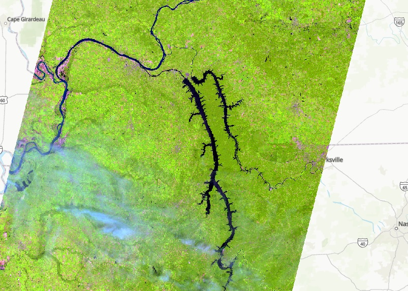  
        <!--  -->

        Landsat 8 Winter Pool Imagery February, 7 2015 displayed over World Topographic Map in ArcGIS Pro  
        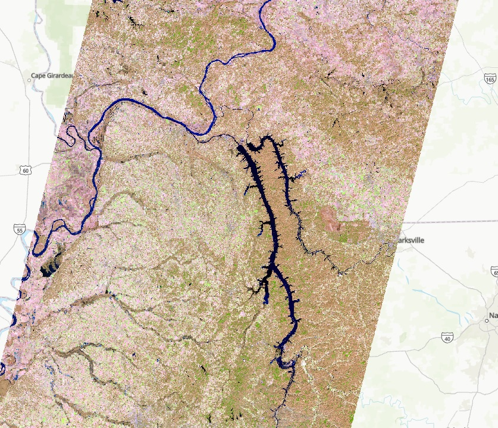
        <!--  -->
3. Used ArcGIS Pro Geoprocessing Tool *Iso Cluster Unsupervised Classification* to classify land cover. Since only looking for lake limited the number of classes to 4.
    - Iso Cluster Unsupervised Classification: Performs unsupervised classification on a series of input raster bands using the Iso Cluster and Maximum Likelihood Classifcation tools
    Iso Clustered Unsupervised Classification for Summer Pool  
    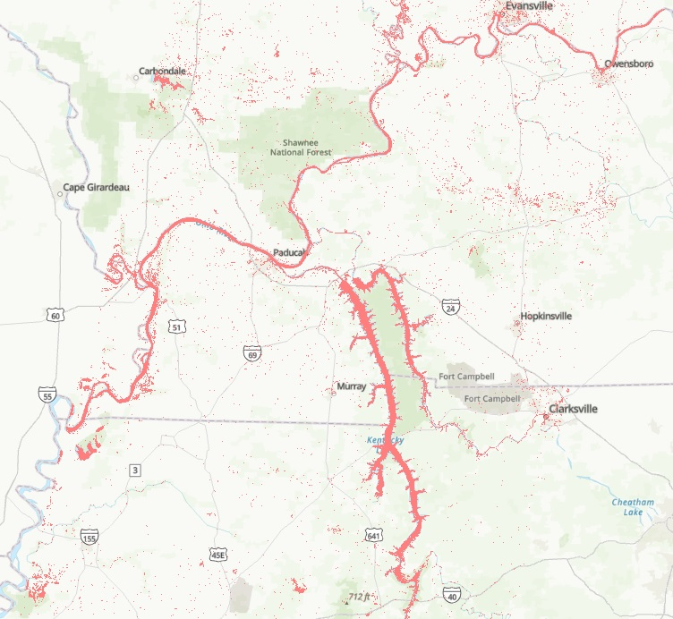
4. Cleaned land cover classifications to fix or remove small errors where extra pixels of imagery were included as part of lakes or minor water bodies included that were not necessary to visualize lakes. Used ArcGIS Pro Geoprocessing Tool *Majority Filter*.
    - Majority Filter: Replaces cells in a raster based on the majority of their contiguous neighboring cells  

        Iso Before Filter for Summer Pool    
        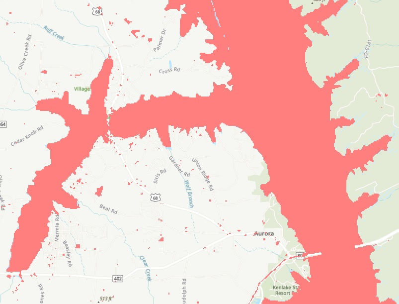  
        Iso After Filter for Summer Pool (more cleaning will occur later)  
        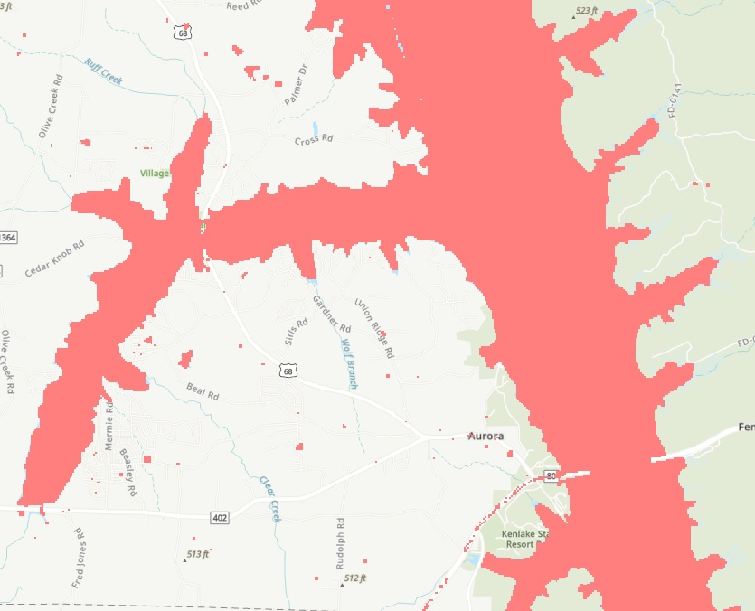  
5. Clean boundaries of lakes where appears too pixelated. Used ArcGIS Pro Geoprocessing Tool *Boundary Clean*
    - Boundary Clean: Smooths the boundary between zones in a raster     
6. Clipped Raster by Polygon Features. The lakes within Kentucky span across two different rasters collected by Landsat 8. Used ArcGIS Pro Geoprocessing Tool *Clip Raster*
    - Clip Raster: Cuts out a portion of raster dataset, mosaic dataset, or image service layer
    - Clipped all raster files to Kentucky State Boundary Polygon first
    - Clipped southern raster files using generic polygon created to eliminate overlap between northern files and southern files
    - Clipped northern raster files using generic polygon created to eliminate excess capture of rivers north of lakes that remain inside Kentucky boundary  

        Before clipped to KY for Summer Pool     
        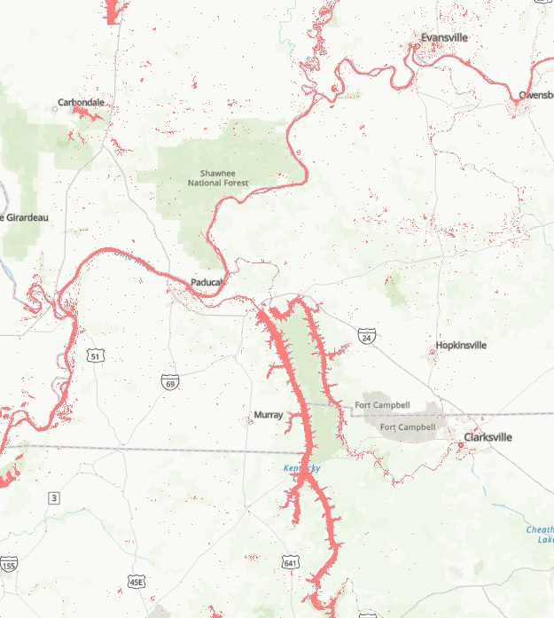  
        After clipped to KY for Summer Pool  
        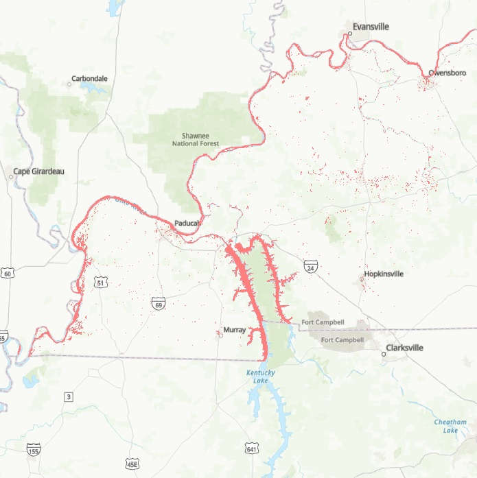
7. Add Area value to attribute table for each clipped raster
    - Reference Layer Properties Raster Information to determine pixel cell (30x30 real-world units)
    - Reference Layer Properties Spatial Reference to determine unit of measurement for real world units (meters)
    - Convert Count of pixels to area
        - Add field to attribute table as float
        - Calculate using Python expression
            - Hectares = (!Count! x 900)/ 10000
8. Create polygon from raster images using ArcGIS Pro Geoprocessing Tool *Raster to Polygon*
    - Raster to Polygon: Converts a raster dataset to polygon features. 
        - Check simplify polygons, create multipart features to limit number of polygons returned.
        - Clean as necessary by deleting excess polygons  

        Before cleaning excess polygons for Summer Pool     
        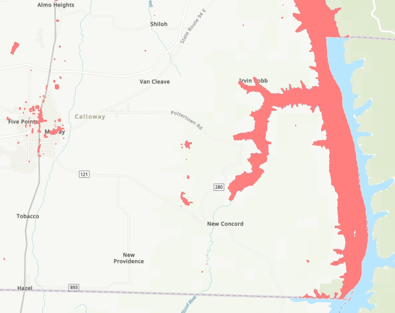  
        After cleaning excess polygons for Summer Pool  
        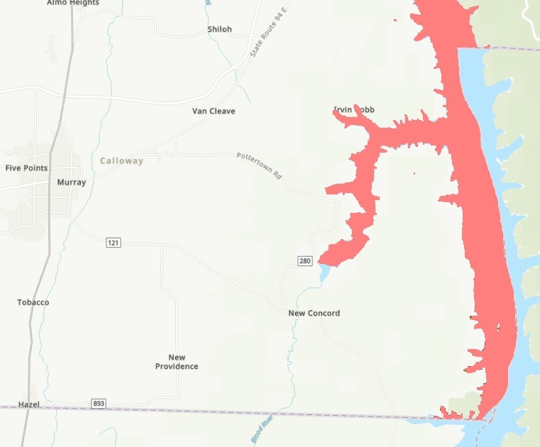
9. Merge Polygons
    - North and South Polygons using Geoprocessing Tool *Merge* (performed for both Summer and Winter)
    - Merge features for each data set into one feature (performed for both Summer and Winter) in editing mode

        Before cleaning excess polygons for Summer Pool     
        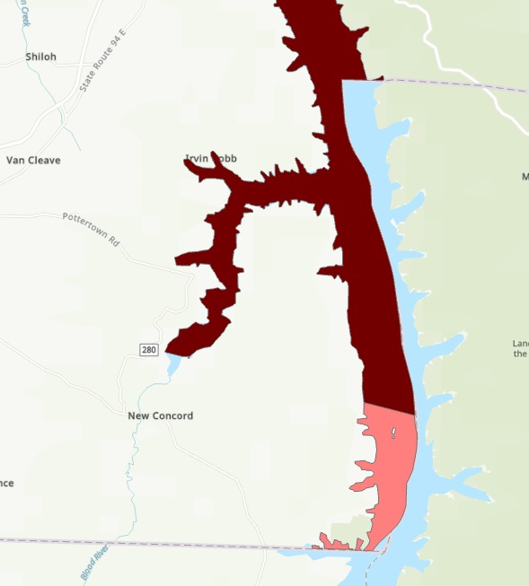  
        After cleaning excess polygons for Summer Pool  
        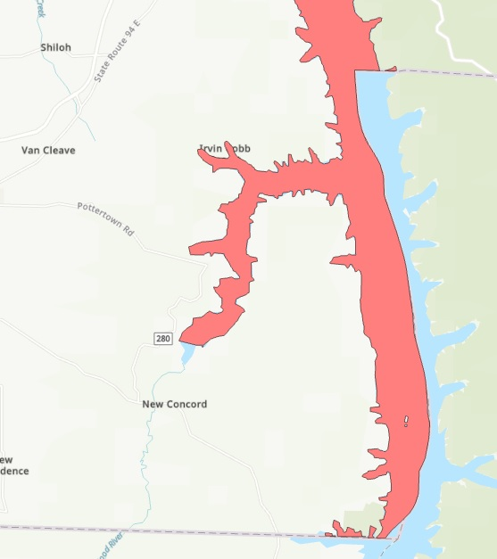
10. Resulting Polygon Layers now ready to Stylize for map visuals   
        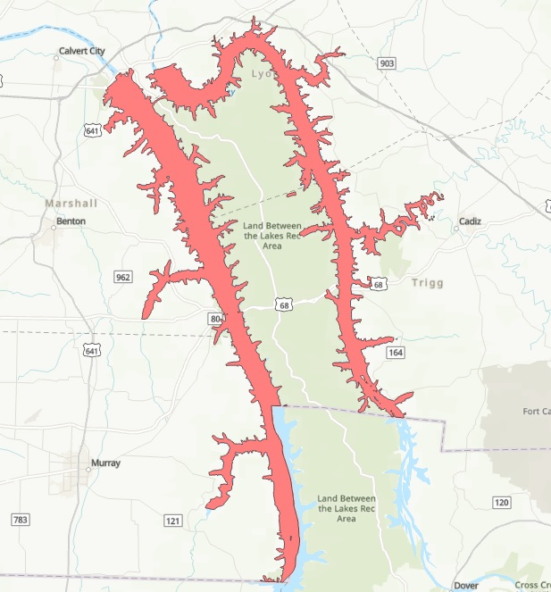

## Part III Proposed Visuals And Steps    
### Visual 1  
 Create map/visual to discuss the difference between winter pool and summer pool surface area of water for Kentucky Lake and Lake Barkley (within Kentucky) using Landsat 8 Data. Find inspiration in John Nelson's [Before-After Layout](https://www.youtube.com/watch?v=n7FkpV5zVNs).

### Visual 2  
Play with Kentucky Lake and Lake Barkley polygon to create a visual using textures in ArcGIS Pro?

### Visual 3
How to Create a Pen and Ink Stipple Effect in ArcGISPro perhaps? 
 
## Final Maps    

Visual 1  
 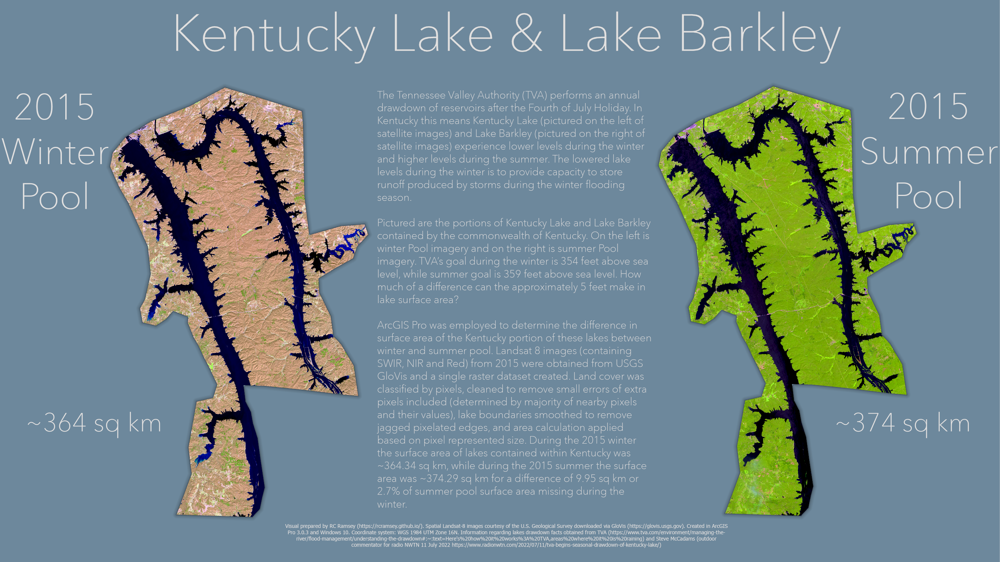

Stay tuned in the next couple of weeks for more!  

## Appendix for Readme  
[GloVis](https://pubs.usgs.gov/gip/137/pdf/gip137.pdf) browser-based tool that allows easy searching of selected areas of interest for subsets of aerial photography and satellite data from the USGS/EROS archive. Jarlath O'Neil-Dunne created an excellent youtube tutorial ([Working with Landsat imagery in ArcGIS Pro](https://www.youtube.com/watch?v=bb9_zANr76A)) for utilizing GloVis.    
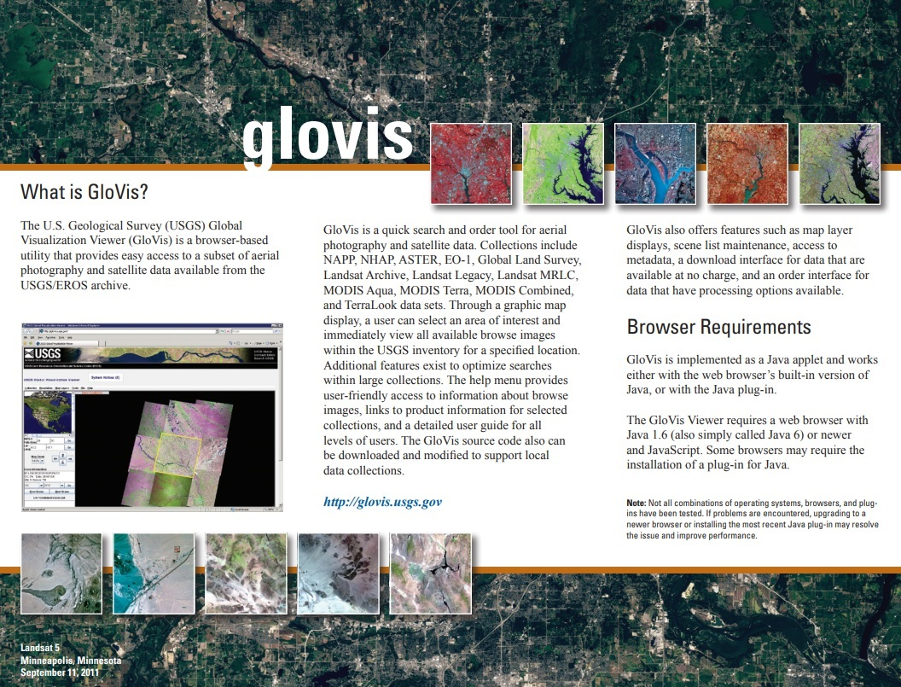  

[Landsat](https://www.usgs.gov/media/images/landsat-missions-timeline) Missions and the timeframe for which they have provided imagery for earth. Respective band designations for Landsat satellites can be found with [USGS](https://www.usgs.gov/faqs/what-are-band-designations-landsat-satellites).    
  

Further Inspiration for Visuals found in John Nelson's   
- [Create a Before-After Layout in ArcGIS Pro](https://www.youtube.com/watch?v=n7FkpV5zVNs)  
- [One Minute Map Hack: Create a Reverse Area of Interest](https://www.youtube.com/watch?v=Dshs8BCNAxI)  
- [How to Make a Map Out of Yarn in ArcGIS Pro](https://www.youtube.com/watch?v=XKBzjFLLz2U)   